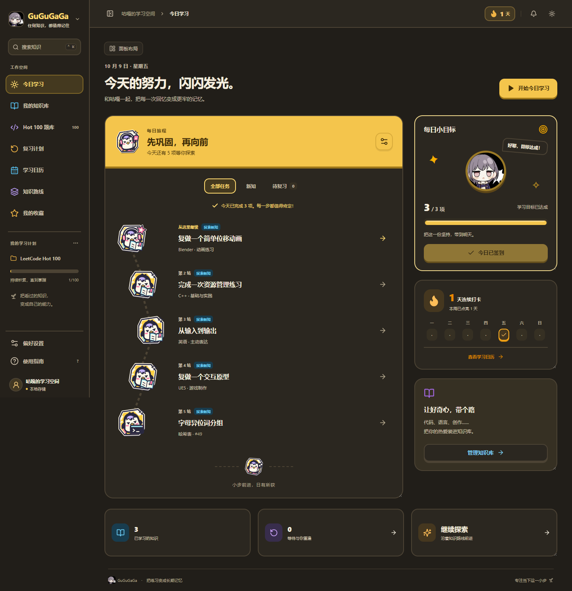
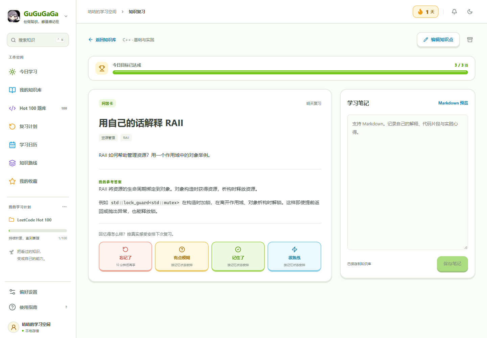

<div align="center">

<p></p>

<h1>GuGuGaGa</h1>

<p>每天一点，把知识记牢。</p>

<p><a href="#功能">功能</a> · <a href="#安装与使用">安装与使用</a> · <a href="#常见问题">常见问题</a> · <a href="#开发">开发</a></p>

</div>

本地知识复习与打卡软件。把 C++、英语、Blender、UE5 等学习笔记整理成知识卡，用间隔复习巩固记忆。内置 LeetCode Hot100，支持 Python / C++ 与 LeetCode / ACM 两种答题模式。

## 支持平台

- Windows 桌面版：解压后打开 `.exe`。
- 本地浏览器：从源码启动后访问学习界面。

## 屏幕截图

| 每日学习旅程                                               | 知识卡复习                                                |
| ---------------------------------------------------------- | --------------------------------------------------------- |
|  |  |

## 功能

- [x] 按主题管理知识库，创建问答、填空与实践步骤卡片
- [x] Markdown / TXT 笔记拆分，AI 提炼知识点，导入前预览和编辑
- [x] 四档记忆反馈、到期复习与每日学习计划
- [x] 企鹅旅程图标、立体按钮、答案展开与目标达成反馈
- [x] 每日学习目标、点击签到、连续记录与日历
- [x] LeetCode Hot100 专题练习，Python / C++ 本地运行
- [x] 自定义简洁题解、注释题解与完整解析
- [x] Markdown 笔记、代码补全、自动缩进与滚轮浏览
- [x] 面板大小与显示控制，侧栏收起，自动记住布局
- [x] 自定义工作空间名称和头像，默认深色主题
- [x] 搜索、收藏、归档，知识库交换与完整数据备份

## 安装与使用

当前桌面构建位于 **`release/GuGuGaGa-v2.3.1/`**。

1. 打开其中的 **`GuGuGaGa.exe`**；运行 `create-shortcut.cmd` 可创建桌面快捷方式。
2. 在「我的知识库」创建主题与卡片，或导入笔记；算法练习进入 Hot100 题库。
3. 在「今日学习」完成复习：**独立回忆 → 揭晓答案 → 选择记忆反馈**。在今日学习或学习日历点击「签到」，记录当天打卡。
4. 打开「面板布局」调整显示与尺寸；答题区拖动分隔线调节大小，随时可恢复布局。

移动程序时保留整个文件夹，包括 `.exe` 和 `_internal`。升级前退出旧版，再打开新版，学习数据会继续沿用。

## 常见问题

### 如何把笔记变成知识卡？

在「我的知识库」中导入 Markdown / TXT，或直接粘贴文本，按标题拆分后编辑卡片预览。AI 拆分需填写兼容 Chat Completions 的 API 地址、模型和 Key；点击生成时会将笔记发送给所选服务，Key 仅用于当前会话与请求。

整理好的卡片可通过标准 JSON 导入与导出：[模板](public/knowledge-template.json) · [JSON Schema](public/knowledge-schema.json) · [格式说明](docs/knowledge-format.md) · [文档拆分指南](docs/document-import.md)。

### 如何专注自己的知识库？

在「偏好设置」中关闭「每日计划包含 Hot100」，今日学习与复习计划就会围绕自己的知识卡安排。

### 如何备份或换电脑？

在「偏好设置」中导出完整备份，到新设备导入即可恢复进度、题解、笔记与个人设置。知识库 JSON 用于合并学习内容，完整备份用于迁移全部个人数据。

## 开发

准备 **Python 3.10+** 和 **Node.js 22+**，在项目根目录执行：

```powershell
npm ci
npm run build
python -m server.app
```

打开 [http://127.0.0.1:8766](http://127.0.0.1:8766)。Windows 也可双击 `start.cmd`。从源码运行 C++ 代码时，需配置支持 C++17 的编译器。

热更新、测试、桌面打包与数据目录见 [开发指南](docs/development.md)。

## 致谢

- [LeetCode Hot100](https://leetcode.cn/studyplan/top-100-liked/) 与 [代码随想录](https://github.com/youngyangyang04/leetcode-master)：题目入口与专题组织。
- [SSP-MMC](https://github.com/maimemo/SSP-MMC)：间隔重复研究参考。
- React、Vite、CodeMirror、Lucide 等开源工具。
